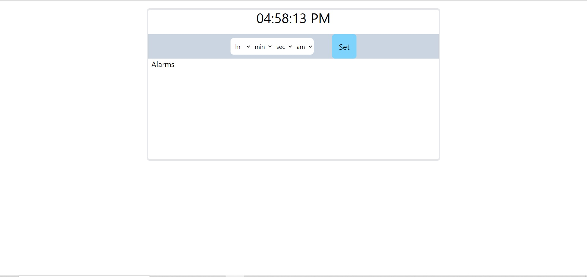
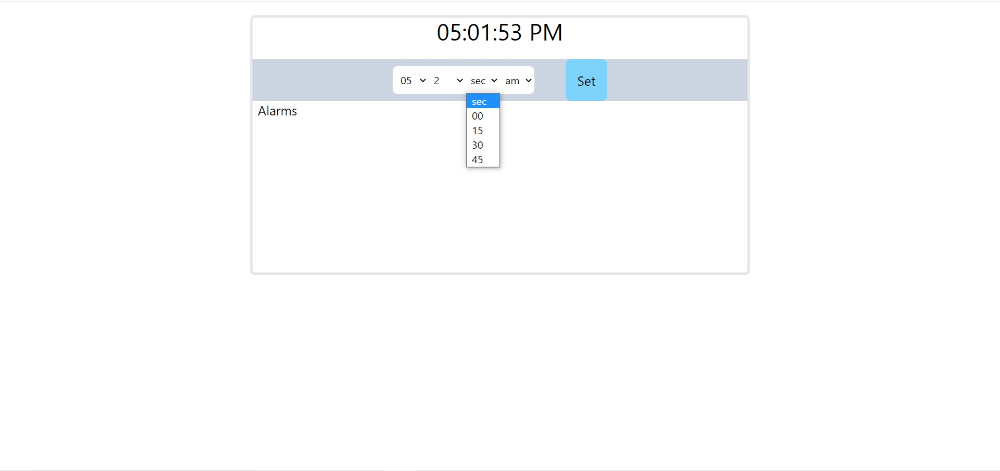
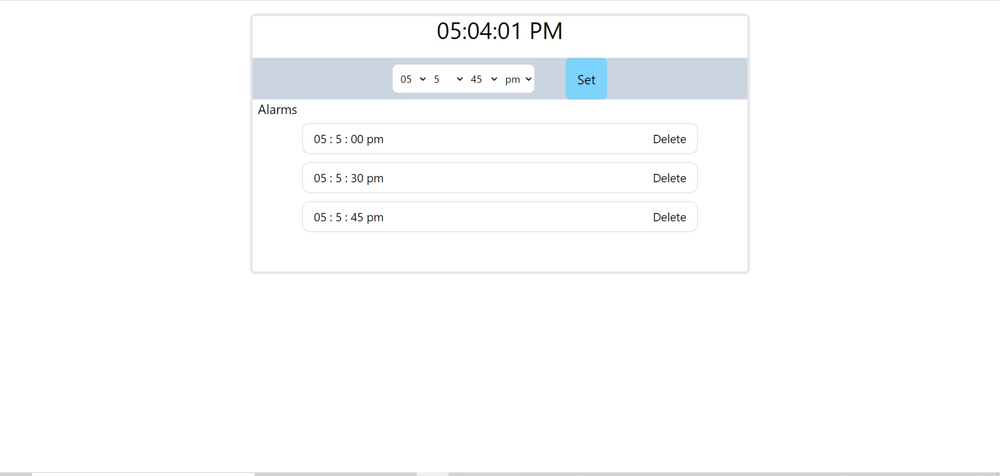
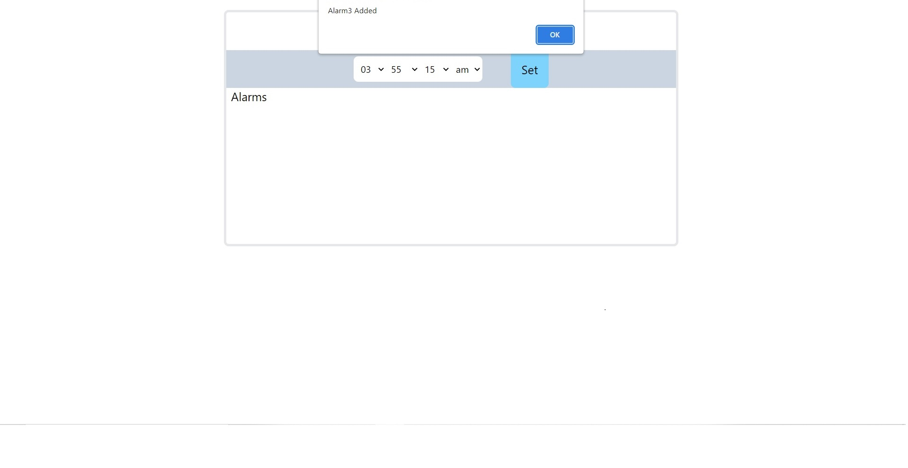
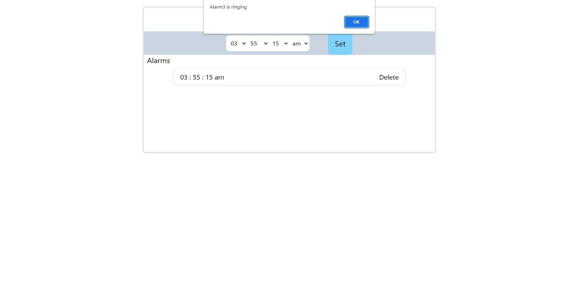

# Simple Alarm Clock

It is a clock that is designed to alert user at a specified time.
This app has current time running constantly so that user can set an alarm accordingly
it has clock face,dropdowns,set button to set an alarm (refer screenshot section)

    

## Screenshots

    Here is the first when the app is launched or in idle state 

    User can set time for an alarm through these dropdowns

    Alarms set by user are listed below

    click on set , user will get an alert ensuring your alarm is set 

    this is how user will get an alert about alarm set by user is ringing & never gonna ring again

## Features

- Clock face
    - Clock shows the current time

- Set Alarm
    - It has select option boxes to set an alarm (hr,min,sec, am/pm)
    - Once the time is set by clicking at “Set Alarm” button, alarm will be added to the alarms list below
    - When the alarm goes of it's just uses JS alert function to alert in the browser

- Alarms list
    - Display a list of all the alarms set by user

- Delete alarm
    - For each alarm there is a dedicated delete button to delete the alarm
    - When the user deletes an alarm it does not alert the user & does not appear in alarm list
    - alarm will be deleted only after user's confirmation

## Technology Used

- HTML
- CSS
- JAVASCRIPT
- TAILWIND CSS ( css framework )
## Author

- [@hishamkhan](https://github.com/hisham8989)

