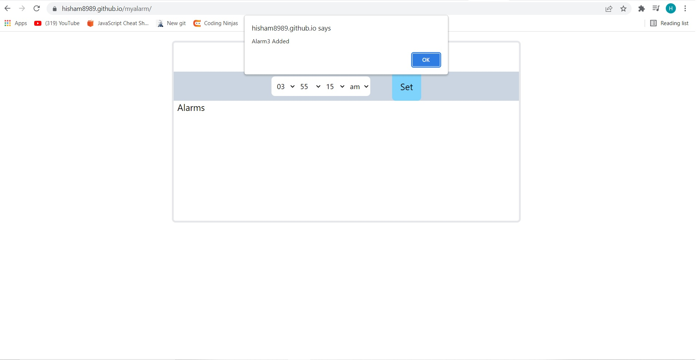

# Simple Alarm Clock

It is a clock that is designed to alert user at a specified time.
The primary function of these clocks is to awaken people from their night's sleep or short naps;
they are sometimes used for other reminders as well.

## Screenshots

## Features

- Clock face
    - Clock showing the current time (seconds,mins,hrs should change as time changes)

- Set Alarm
    - It select option boxes to set an alarm (hr,min,sec, am/pm)
    - Once the sets the time and click “Set Alarm” button, it will be added that alarm to the alarms list below
    - When the alarm goes of it just uses JS alert function to alert in the browser

- Alarms list
    - Display a list of all the alarms set by user

- Delete alarm
    - For each alarm give a delete button to delete the alarm
    - When the user deletes an alarm it does not alerts the user
    - when the user deletes an alarm among alarms list it deletes that alarm only

